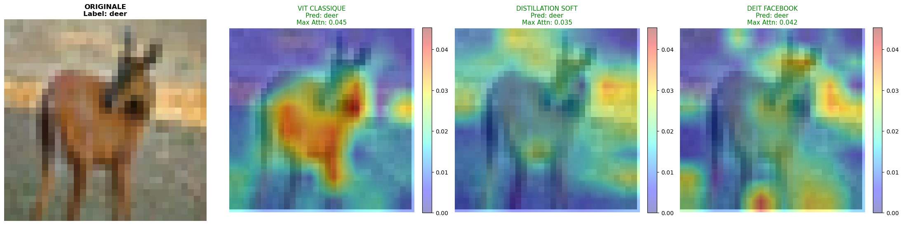
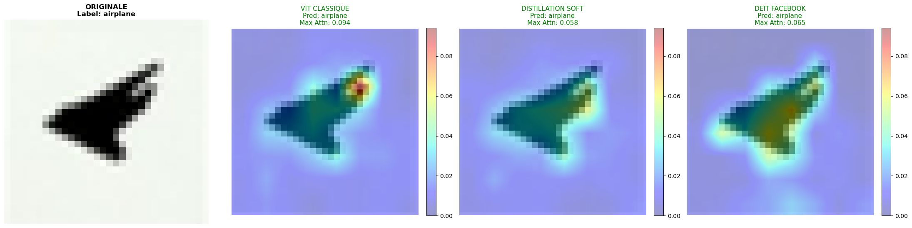

# Vision Transformer sur CIFAR-10
Cliquer sur le logo colab pour ouvrir le notebook dans google colab ! 

## Présentation Vidéo
**[Voir la vidéo introduisant les concepts (10 min)](https://youtu.be/1T7yPAtR2fs)** *(Explication de l'architecture, du mécanisme d'attention et distillation)*

## Contexte & Objectif
L'idée est de créer son propre petit Vision Transformer pour CIFAR10, de visualiser les cartes d'attention et d'améliorer leur robustesse en utilisant une technique de distillation classique et une technique de distillation avec token de distillation comme présentée dans l'article de Facebook.

### Architectures comparées :
1.  **ViT Baseline** : Transformer standard entraîné "from scratch".
2.  **ViT + Distillation Simple** : Entraînement guidé par un professeur (ResNet).
3.  **DeiT (Distillation Token)** : Architecture spécifique avec un token dédié à l'apprentissage des biais inductifs du CNN.

## Installation & Utilisation

Ce projet est conçu pour être exécuté directement sur **Google Colab**.

1. Ouvrez le notebook via le badge ci-dessus.
2. Le notebook propose deux modes :
   * **Mode DÉMO** : Télécharge automatiquement les poids pré-entraînés pour visualiser immédiatement les cartes d'attention.
   * **Mode TRAIN** : Permet de relancer l'entraînement complet des 3 modèles.

## Résultats & Visualisation de l'Attention

L'un des défis majeurs des Transformers est l'interprétabilité. Nous visualisons ici comment le mécanisme d'attention (Self-Attention) se focalise sur l'image.

### Exemple de Carte d'Attention

*On observe que l'attention du modèle change en fonction de la méthode utilisée. Le notebook analyse ses changements.*

## Références
* *An Image is Worth 16x16 Words: Transformers for Image Recognition at Scale* (Dosovitskiy et al., 2020)
* *Training data-efficient image transformers & distillation through attention* (Touvron et al., 2021)
